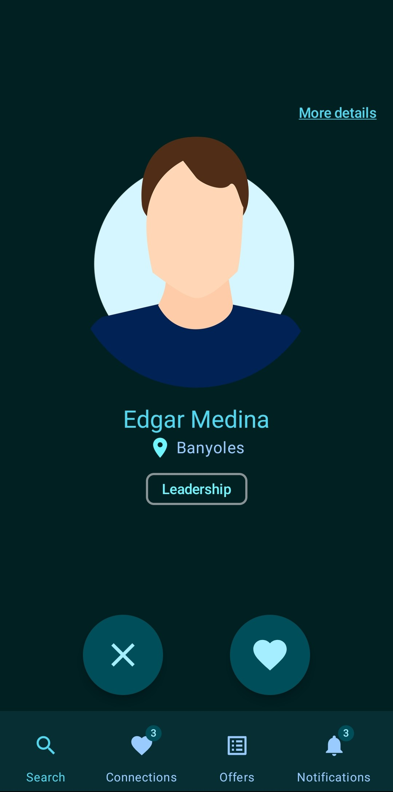
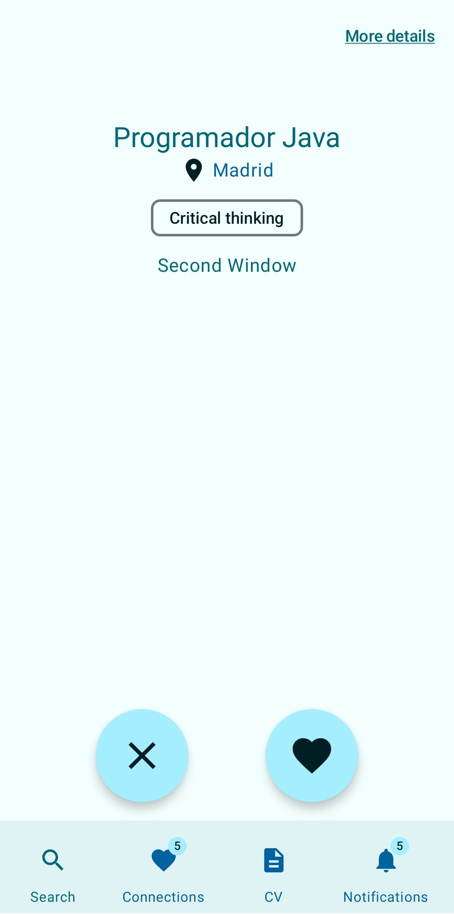
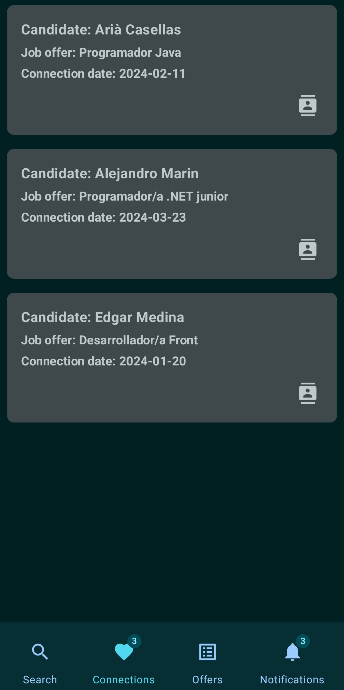
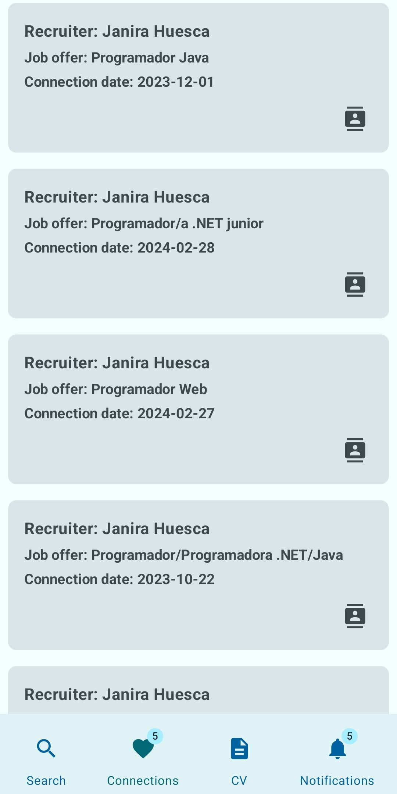
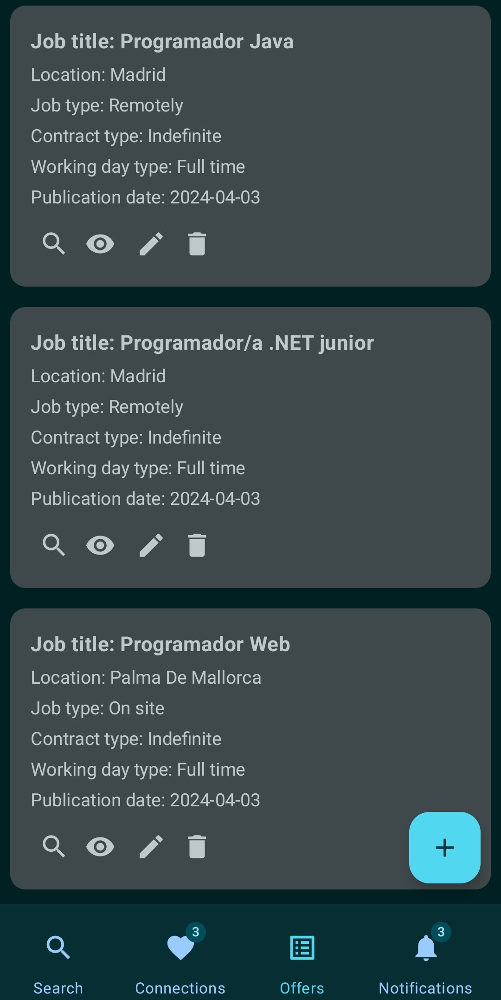
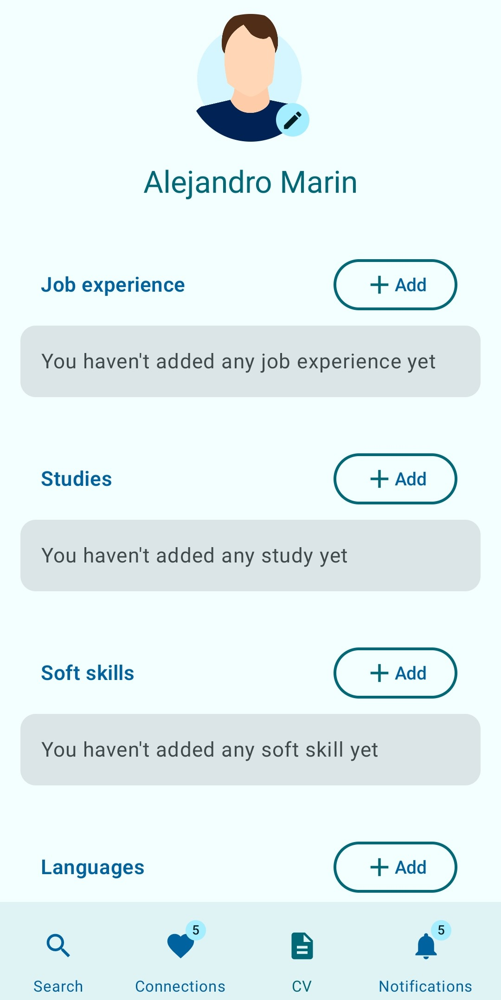
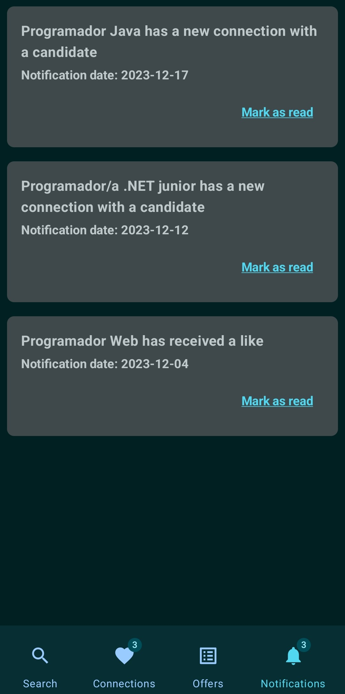
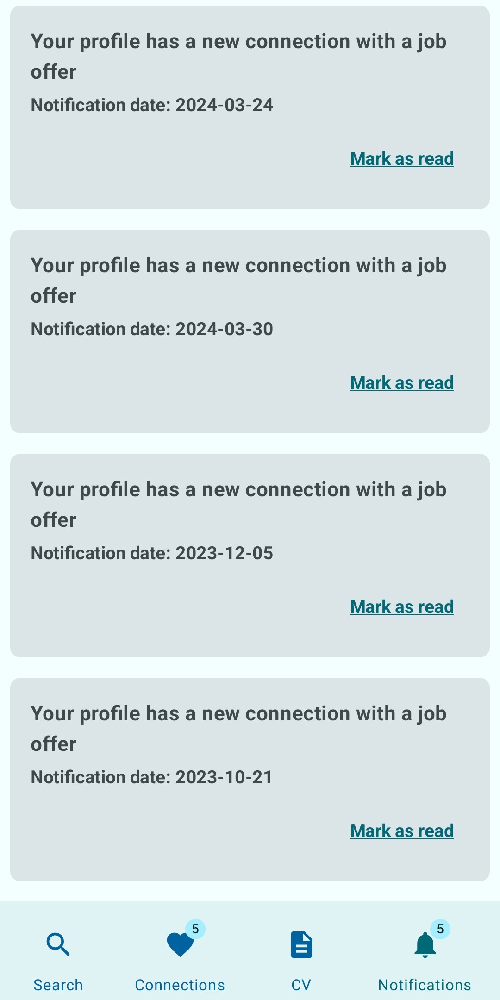

# Projecte transversal 2n DAM

## Descripció del projecte:

Aquest projecte té com a finalitat desenvolupar una aplicació per a mòbils. 
L’objectiu final del projecte és la creació d’un prototip que permeti fer una demostració de les funcionalitats de l’app als agents interessats. 
A més, aquesta aplicació està en consonància amb la ODS (Objectiu de Desenvolupament Sostenible) 8: "Treball digne i creixement econòmic".

## Metodologia:
 
Per portar a terme aquest projecte hem fet servir la metodologia col·laborativa d’Aprenentatge Basat en Projectes (ABP).
A més, per encarar el projectes'ha utilitzat la metodologia àgil de SCRUM.

## Temàtica de l'aplicació desenvolupada:

Swipe4Job és una aplicació innovadora que simplifica radicalment la cerca de feina per a candidats i reclutadors.
Inspirada en l'experiència de Tinder, permet als reclutadors revisar perfils de candidats amb rapidesa i eficàcia mitjançant la funció de "swipe".
A més, connecta directament els candidats amb les ofertes de feina que s'ajustin als seus perfils, fent que trobar i aplicar a noves oportunitats sigui més fàcil i atractiu que mai.

## Equip:

* Arià Casellas: Database Administrator & Tester
* Janira Huesca: Art Director, Front End Developer & Project Manager
* Alejandro Marin: Programmer Manager & Commercial
* Edgar Medina: Back End Programmer & Documentation Manager

## Rols dels usuaris de l'aplicació:

* Candidate: Cerca de feina
* Recruiter: Cerca de candidats
* Admin: Gestió de la plataforma

## Funcionalitats del candidat:

* Search: Els candidats poden anar visualitzant aquelles ofertes que encaixen més amb el seu perfil professional i les seves preferències.
* Connections: Els candidats veuen aquelles ofertes amb les quals han tingut una Connexió, podent visualitzar les dades de contacte dels reclutadors que gestionen aquestes  ofertes.
* CV: Els candidats configuren els seus perfils professionals, que seran les dades que els reclutadors podran visualitzar.
* Notifications: Pantalla en la qual els candidats poden visualitzar aquells esdeveniments rellevants relacionats amb els seus perfils (connexions que ha tingut, “likes” obtinguts...).

## Funcionalitats del reclutador:

* Search: Els reclutadors poden anar visualitzant aquells perfils professionals que encaixen més amb les ofertes de feina que han publicat.
* Connections: Els reclutadors veuen aquells candidats amb els quals han tingut una Connexió, podent visualitzar les dades de contacte d’aquests candidats.
* CV: Els reclutadors publiquen i gestionen les seves ofertes de feina, que seran les dades que els candidats podran visualitzar.
* Notifications: Pantalla en la qual els reclutadors poden visualitzar aquells esdeveniments rellevants relacionats amb les seves ofertes (connexions que ha tingut, “likes” obtinguts...).

## Captures de pantalla:

* Search screen
<table>
  <tr>
    <td></td>
    <td></td>
  </tr>
</table>

* Connections screen
<table>
  <tr>
    <td></td>
    <td></td>
  </tr>
</table>

* Job Offers / Candidate CV screen
<table>
  <tr>
    <td></td>
    <td></td>
  </tr>
</table>

* Notifications screen
<table>
  <tr>
    <td></td>
    <td></td>
  </tr>
</table>

